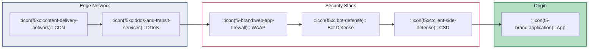

# F5 Visual Content

## Overview

This skill extends `brand-guardian` with format-specific rules.
The foundational color palette, typography, and brand identity
rules are defined there — this skill tells you how to apply them
correctly for each output format.

If you have not already consulted `brand-guardian` for the base
brand specs, do so before applying the format-specific guidance
below.

**Keywords**: Mermaid diagrams, Excalidraw, PowerPoint, PPTX,
slides, presentation, YouTube, video thumbnail, social media,
screenshots, visual assets, diagrams, architecture diagrams

## Mermaid diagrams

The docs-theme pre-configures Mermaid with F5-branded theme
variables and 9 registered icon packs. Diagrams render on a
white-forced background container regardless of site theme.

### Registered icon packs

Source: `docs-theme/config.ts` lines 307-317

| Pack name | Icon count | Best for |
| --------- | ---------- | -------- |
| `f5-brand` | 665 | F5 product/security concepts |
| `f5xc` | 30 | F5 Distributed Cloud services |
| `hashicorp-flight` | 672 | Cloud providers, K8s, vendor logos |
| `carbon` | 2,582 | IBM Carbon design UI icons |
| `lucide` | ~1,600 | Clean general-purpose UI icons |
| `mdi` | 7,638 | Material Design comprehensive set |
| `phosphor` | 9,161 | Phosphor icons (6 weight variants) |
| `tabler` | 6,034 | Tabler line icons |
| `azure` | 606 | Azure architecture icons |

Additional packs available but not registered in Mermaid:
`aws` (885), `gcp` (216), `simple-icons` (3,200+).

### Icon syntax in Mermaid

```
flowchart LR
  A["::icon(f5xc:bot-defense):: Bot Defense"]
  B["::icon(f5-brand:web-app-firewall):: WAF"]
```

For `architecture-beta` syntax:

```
architecture-beta
  service bot(f5xc:bot-defense)[Bot Defense]
  service waf(f5-brand:web-app-firewall)[WAF]
```

### Color assignments by diagram element role

Use these F5 palette colors for consistent, meaningful
diagrams. The goal is that viewers can intuit meaning from
color before reading labels.

| Element role | Fill color | Border color | Text |
| ------------ | ---------- | ------------ | ---- |
| Infrastructure / networking | `#e8ecf4` | `#0e41aa` (River) | `#1a1a2e` |
| Security services | `#fff` | `#e4002b` (Red) | `#1a1a2e` |
| Success / healthy path | `#b2dfc4` (Jade-1) | `#009639` (Jade) | `#1a1a2e` |
| Warning / caution | `#ffe4c4` (Tangerine-1) | `#f29a36` (Tangerine) | `#1a1a2e` |
| Error / threat / blocked | `#f7b2bf` (Red-1) | `#e4002b` (Red) | `#1a1a2e` |
| Premium / advanced | `#f0e6f6` | `#62228b` (Eggplant) | `#1a1a2e` |
| Connection lines | — | `#0e41aa` (River) | — |
| Notes / annotations | `#ffe4c4` | `#f29a36` (Tangerine) | `#1a1a2e` |

For the full Mermaid theme variable configuration, consult
`references/diagram-theming.md`.

### Example: Security architecture diagram



## Excalidraw drawings

When creating Excalidraw diagrams for F5 content:

- Use F5 palette hex values for fill and stroke colors —
  do not use Excalidraw's default color picker
- Preferred fills: River-1 (`#b7c6e5`), Tangerine-1
  (`#ffe4c4`), Jade-1 (`#b2dfc4`), Eggplant-1 (`#cdabe3`)
  for light node backgrounds
- Preferred strokes: River (`#0e41aa`), Red (`#e4002b`),
  Jade (`#009639`), Tangerine (`#f29a36`)
- Text: use black (`#000`) or near-black (`#1a1a2e`)
- Export as SVG with transparent background for docs embedding
- Use Proxima Nova or the closest system font for text
  elements (Excalidraw defaults to a hand-drawn font —
  switch to "Normal" font mode for professional output)

## Screenshots

Screenshots in documentation should capture both light and
dark mode variants of any UI being shown.

### Screenshot component usage

```astro
import Screenshot from
  '@f5xc-salesdemos/docs-theme/components/Screenshot.astro';

<Screenshot
  alt="Bot Defense dashboard showing 3 blocked requests"
  light="/images/bot-defense-light.png"
  dark="/images/bot-defense-dark.png"
/>
```

### Capture guidelines

- **Dimensions**: 1200px minimum width for full-width screenshots
- **File format**: PNG for screenshots, SVG for diagrams
- **File location**: `docs/images/` with descriptive filenames
  (e.g., `bot-defense-dashboard.png` not `screenshot1.png`)
- **Alt text**: describe what the screenshot shows, not just
  what it is
- **Browser chrome**: crop out browser UI unless it is relevant
  to the content
- **Sensitive data**: redact any real customer data, API keys,
  or internal URLs

The theme automatically applies border, border-radius, and
shadow treatment to screenshot images. For full component
prop reference, consult `references/screenshot-standards.md`.

## PowerPoint / Google Slides

When creating presentation decks for F5:

### Slide color palette

| Slide element | Color | Hex |
| ------------- | ----- | --- |
| Slide background (light) | White | `#ffffff` |
| Slide background (dark) | River-4 | `#072155` |
| Title text (on light) | Black | `#000000` |
| Title text (on dark) | White | `#ffffff` |
| Accent / highlight | F5 Red | `#e4002b` |
| Body text | Black-3 | `#343434` |
| Subtle text | Black-2 | `#666666` |

### Font mapping

| Brand font | PowerPoint fallback |
| ---------- | ------------------- |
| Neusa Next Pro Wide | Arial Black |
| Proxima Nova | Arial |

If Neusa and Proxima are installed on the authoring system,
use them directly.

### Slide layout guidelines

- F5 logo on every slide — top-right or bottom-right
- Title slides: F5 Red or River gradient background with
  white text (Neusa Bold)
- Content slides: white background, dark text
- Data visualization: use the brand color series in order —
  River, Bay, Jade, Tangerine, Raspberry, Eggplant — for
  distinct chart categories

For complete slide template specs, consult
`references/presentation-format.md`.

## Video / YouTube

### Thumbnails

- **Background**: F5 Red or River gradient, or dark navy
  (River-4 `#072155`)
- **Text**: white, Neusa Next Pro Wide Bold (or Arial Black
  fallback), large enough to read at thumbnail size
- **F5 logo**: small watermark in corner
- **Dimensions**: 1280x720px (16:9) at minimum

### Title cards and lower thirds

- Use F5 Red accent bar with white text
- Font: Neusa Next Pro Wide for speaker name / topic
- Background: dark navy or semi-transparent dark overlay

### Video scripts

Follow the same tone and voice rules from `brand-guardian`:
confident, technical but accessible, active voice, correct
product naming.

## Social media

### Platform dimensions

| Platform | Image size | Aspect ratio |
| -------- | ---------- | ------------ |
| LinkedIn / X (Twitter) card | 1200x630 | 1.91:1 |
| LinkedIn post | 1200x1200 | 1:1 |
| Instagram post | 1080x1080 | 1:1 |
| Instagram story | 1080x1920 | 9:16 |
| YouTube thumbnail | 1280x720 | 16:9 |

### Social media design rules

- Use brand color backgrounds (River, Red, or dark navy)
  with contrasting white text
- Include the F5 logo on all branded social graphics
- Hashtag conventions: `#F5` `#F5XC` `#AppSecurity`
  `#MultiCloud` `#BotDefense`
- Keep text minimal — social images should communicate
  the message at a glance
